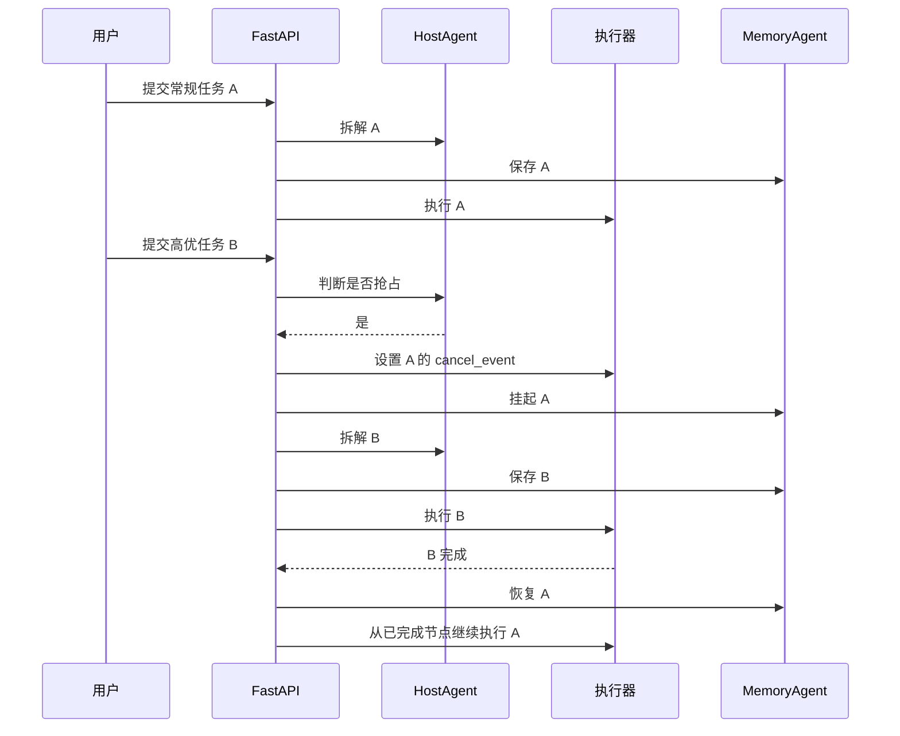

# 项目实现与架构说明

## 1. 项目定位

当前项目是一个面向变电站巡检场景的多智能体调度演示系统，目标不是做真实设备控制，而是演示以下几类能力：

- 使用大模型将自然语言任务拆解为可执行的 DAG 节点
- 根据节点语义将任务路由给不同能力的 Agent
- 在执行过程中支持高优先级任务抢占
- 被抢占任务可以挂起，并在高优任务结束后从断点恢复
- 通过 WebSocket 将执行状态实时同步到前端

项目整体采用前后端分离结构：

- 后端：FastAPI + DashScope(Qwen) + 内存态任务调度
- 前端：React + ReactFlow + Axios + WebSocket

## 2. 目录结构

```text
emergency/
├── backend/
│   ├── main.py                  # FastAPI 入口、全局调度流程
│   ├── models.py                # 任务、节点、状态等数据模型
│   ├── config.json              # 模型、路由、优先级等配置
│   ├── config_loader.py         # 配置加载
│   ├── agents/
│   │   ├── host_agent.py        # 任务拆解与抢占判断
│   │   ├── memory_agent.py      # 任务状态记忆
│   │   ├── router.py            # 语义路由
│   │   └── execution_agents.py  # 各类 Agent 的执行入口
│   └── services/
│       ├── llm_service.py       # Qwen 文本生成与向量服务封装
│       └── vector_service.py    # 相似度计算
├── frontend/
│   ├── src/App.jsx              # 页面主状态与通信逻辑
│   └── src/components/
│       ├── TaskStack.jsx        # 任务栈和已完成任务列表
│       ├── DAGView.jsx          # DAG 可视化
│       └── AgentStatus.jsx      # Agent 当前状态栏
├── start.sh                     # 一键安装并启动前后端
└── README.md
```

## 3. 后端架构

### 3.1 核心角色

后端的核心不是传统的消息队列或工作流引擎，而是围绕 `backend/main.py` 组织的一组全局对象：

- `host_agent`
  - 负责识别任务优先级
  - 调用 LLM 将用户输入拆成 DAG
  - 判断新任务是否应该抢占当前任务
- `memory_agent`
  - 将任务状态保存在内存字典中
  - 负责挂起、恢复、节点结果写回
- `router`
  - 在系统启动时为各 Agent 能力描述生成 embedding
  - 为每个任务节点选择合适的 Agent
- `task_stack`
  - 当前活跃任务栈
  - 栈顶表示当前正在执行或等待恢复的任务
- `cancel_events`
  - `task_id -> asyncio.Event`
  - 用于向正在执行的任务发送中断信号
- `active_connections`
  - 当前连接中的 WebSocket 客户端列表

### 3.2 数据模型

`backend/models.py` 定义了整个系统使用的基础领域模型：

- `Priority`
  - `HIGH`
  - `NORMAL`
- `NodeStatus`
  - `pending`
  - `running`
  - `completed`
- `TaskStatus`
  - `running`
  - `suspended`
  - `completed`
- `TaskNode`
  - 节点 ID
  - 节点描述
  - 节点状态
  - 被分配的 Agent 类型
  - 执行结果
  - 依赖节点列表
- `Task`
  - 任务 ID
  - 任务标题
  - 优先级
  - 任务状态
  - DAG 节点列表
  - 当前执行索引
  - 已完成节点列表

这些模型既是后端调度的内部对象，也是 WebSocket 和 HTTP 接口对前端返回的数据结构。

### 3.3 配置中心

`backend/config.json` 当前控制三类行为：

- LLM 配置
  - 文本模型：`qwen-plus`
  - 向量模型：`text-embedding-v3`
- 任务配置
  - 最大拆解节点数：`10`
  - 高优关键字：`突发`、`告警`、`异常`、`紧急`、`高温`、`立即`、`优先级高`
- 路由配置
  - 当前策略：`vector_similarity`
  - `top_k`：`1`

`config_loader.py` 在启动时读取配置文件，并以属性形式提供给各模块使用。

## 4. 任务执行主流程

### 4.1 提交任务

用户调用 `POST /api/task/submit` 后，后端执行如下流程：

1. `host_agent.decompose_task(prompt)`
2. `memory_agent.save_task(new_task)`
3. 如果任务栈栈顶已有 `running` 任务，则比较优先级
4. 若新任务优先级更高，则挂起当前任务并发送取消信号
5. 将新任务压入 `task_stack`
6. 广播 `task_started`
7. 通过 `asyncio.create_task` 异步启动执行

### 4.2 任务拆解

`backend/agents/host_agent.py` 的逻辑分两部分：

- `detect_priority`
  - 基于关键字做优先级识别
  - 当前是简单规则匹配，不依赖 LLM
- `decompose_task`
  - 构造提示词，要求 Qwen 返回包含 `nodes` 的 JSON
  - 每个节点包含 `id`、`description`、`dependencies`
  - 若 JSON 解析失败，则退化为按文本行切分为无依赖步骤

这意味着当前 DAG 生成具备“LLM 优先、文本兜底”的容错机制。

### 4.3 抢占与挂起

当系统已存在一个运行中的任务时，新任务提交后会触发抢占判断：

- 当前判断规则只比较 `HIGH > NORMAL`
- 如果允许抢占：
  - 设置当前任务对应的 `cancel_event`
  - 调用 `memory_agent.suspend_task`
  - 将当前任务状态置为 `suspended`
  - 将所有 `running` 节点重置回 `pending`
  - 已经完成的节点保持 `completed`

这样可以保证恢复时不会从头执行整个任务，而是只继续剩余节点。

### 4.4 DAG 调度执行

`execute_task(task)` 是系统最核心的调度函数，负责以下工作：

- 为任务创建 `cancel_event`
- 从任务 DAG 中收集已完成节点，支持断点恢复
- 循环寻找“所有依赖均已完成”的 `ready_nodes`
- 对每个待执行节点做路由
- 将节点状态设置为 `running`
- 广播最新任务状态
- 并发执行同一层可运行节点

这里有两个关键实现细节：

- 同层并发
  - 使用 `asyncio.gather` 并行执行多个 ready 节点
- 同 Agent 串行
  - `execute_node_with_broadcast` 内部为每个 Agent 使用 `asyncio.Lock`
  - 如果多个节点都被路由到同一个 Agent，它们会被串行执行

因此，系统不是“全局串行”，也不是“无限并行”，而是“按 DAG 并行、按 Agent 串行”的混合执行模型。

### 4.5 节点执行

`backend/agents/execution_agents.py` 中维护了一个 `AGENTS` 字典，用于定义各 Agent 的角色提示词，例如：

- `Aerial`：无人机巡检
- `Ground`：地面近距检查
- `Thermal`：热成像检测
- `Emergency`：应急响应
- `Diagnosis`：故障诊断
- `Report`：报告汇总

节点执行过程如下：

1. 根据 `agent_name` 读取对应角色提示词
2. 拼接任务描述形成最终提示词
3. 调用 `call_qwen`
4. 使用 `run_in_executor` 将同步 LLM 请求放到线程池执行，避免阻塞事件循环
5. 返回 100 字以内的执行结果

这部分本质上是“基于角色提示词模拟专业 Agent”的实现，而不是独立的多进程或多实例 Agent 服务。

### 4.6 状态写回与恢复

节点执行完成后：

- 节点状态更新为 `completed`
- 节点结果写入 `node.result`
- `memory_agent.update_node_status` 将节点 ID 写入 `task.completed_nodes`
- 通过 WebSocket 广播最新任务状态

当任务全部完成后：

1. 标记任务为 `completed`
2. 执行 `finish_task`
3. 从 `task_stack` 中移除当前任务
4. 广播 `task_completed`
5. 如果栈顶仍有挂起任务，则：
   - 调用 `memory_agent.resume_task`
   - 广播 `task_resumed`
   - 再次调用 `execute_task_with_resume`

这一套逻辑实现了“高优任务插队完成后，原任务从断点继续执行”。

## 5. Agent 路由架构

`backend/agents/router.py` 实现了语义路由，支持三种策略：

- `vector_similarity`
- `llm_selection`
- `hybrid`

当前配置实际启用的是 `vector_similarity`。

### 5.1 路由初始化

`SemanticRouter` 初始化时，会读取所有 `AgentDescription`，并为每个 Agent 的 `capabilities` 生成 embedding。这个操作只做一次，结果缓存在内存中。

### 5.2 向量路由

路由某个任务节点时：

1. 为节点描述生成 embedding
2. 与所有 Agent 能力向量做余弦相似度比较
3. 选择相似度最高的 Agent

相关实现位于：

- `services/llm_service.py`
- `services/vector_service.py`

### 5.3 混合路由

如果切换为 `hybrid`，则流程会变为：

1. 先用向量召回 Top-K 候选 Agent
2. 再让 LLM 在候选集合中做最终选择

这种设计兼顾效率与语义判断能力，但当前项目默认没有开启。

## 6. 前端架构

### 6.1 页面结构

前端主入口是 `frontend/src/App.jsx`，页面分为左右两栏：

- 左侧
  - 任务输入框
  - 活跃任务栈
  - 已完成任务列表
- 右侧
  - DAG 执行视图
  - Agent 状态栏

### 6.2 状态管理

前端没有使用 Redux、Zustand 等全局状态库，而是直接在 `App.jsx` 中使用 React `useState` 管理：

- `taskStack`
  - 当前活跃任务栈
- `completedTasks`
  - 前端维护的已完成任务历史
- `viewingTask`
  - 当前正在查看的任务
- `autoFollow`
  - 是否自动跟随最新执行任务
- `agentStatus`
  - 每个 Agent 当前是否有执行中的节点
- `taskCacheRef`
  - 用于缓存各任务最新快照，避免用户手动查看旧对象

### 6.3 通信方式

前端使用两种通信机制：

- HTTP
  - 初始化时通过 `GET /api/task/stack` 拉取当前任务栈
  - 提交任务时通过 `POST /api/task/submit`
- WebSocket
  - 连接 `ws://localhost:8000/ws/execution`
  - 接收任务开始、任务更新、任务完成、任务恢复等实时事件

这种模式是“HTTP 发起动作，WebSocket 订阅状态”。

### 6.4 DAG 可视化

`frontend/src/components/DAGView.jsx` 使用 ReactFlow 展示任务 DAG：

- 基于节点依赖计算层级
- 使用 BFS 计算每个节点所在列
- 同层节点做垂直居中布局
- 边使用 `smoothstep`
- 运行中节点对应的边会设置为 `animated`

节点颜色用于表达状态：

- 绿色：已完成
- 黄色：执行中
- 灰色：待执行

### 6.5 任务栈展示

`TaskStack.jsx` 的展示逻辑比较直接：

- 活跃任务按栈顺序逆序显示，栈顶任务排在最上方
- 不同状态使用不同颜色和边框
- 显示任务优先级、已完成节点数、总节点数、进度条
- 若任务被挂起，会额外展示断点进度

### 6.6 Agent 状态栏

`AgentStatus.jsx` 本身不负责推导状态，只负责展示。

真正的推导逻辑在 `App.jsx` 的 `updateAgentStatus`：

- 遍历当前查看任务的 DAG
- 找出所有 `running` 节点
- 将节点描述映射到对应 `agent_type`

因此，前端底部状态栏展示的是“当前查看任务视角下的 Agent 占用情况”，不是整个系统全局资源视图。

## 7. 实时事件流

系统当前通过 WebSocket 广播以下几类消息：

- `task_started`
- `task_update`
- `task_completed`
- `task_resumed`
- `task_stack_update`

广播内容一般包含：

- `type`
- `task`
- `task_stack`

其中 `task_update` 是最频繁的事件，主要在以下时机触发：

- ready 节点完成路由后
- 某个节点执行完成后
- 任务整体完成后

## 8. 核心时序

```mermaid
flowchart LR
    U["用户提交任务"] --> API["POST /api/task/submit"]
    API --> H["HostAgent 拆解任务"]
    H --> M["MemoryAgent 保存任务"]
    M --> S["压入 task_stack"]
    S --> E["execute_task 调度 DAG"]
    E --> R["SemanticRouter 选择 Agent"]
    R --> X["execution_agents 调用 Qwen 执行节点"]
    X --> W["写回节点状态与结果"]
    W --> B["WebSocket 广播 task_update"]
    B --> F["前端更新任务栈 / DAG / Agent 状态"]
```



抢占恢复的时序如下：



## 9. API 说明

### 9.1 `POST /api/task/submit`

请求体：

```json
{
  "prompt": "请对变电站执行一次例行巡检"
}
```

返回：

```json
{
  "task_id": "abcd1234",
  "status": "started"
}
```

### 9.2 `GET /api/task/stack`

返回当前活跃任务栈。

### 9.3 `GET /api/task/{task_id}/status`

返回指定任务的当前状态。

### 9.4 `WS /ws/execution`

用于接收任务执行过程中的实时广播消息。

## 10. 当前实现特点

### 10.1 优点

- 结构清晰，适合做演示和原型验证
- 抢占、挂起、恢复逻辑完整，业务亮点明确
- DAG、任务栈、Agent 占用都能直观看到
- 路由策略可切换，方便继续扩展实验

### 10.2 当前边界

从现有代码看，这个项目更偏“演示型架构”，当前仍有一些明确边界：

- 任务状态仅保存在内存中
  - 服务重启后任务会丢失
- `task_stack`、`cancel_events`、`active_connections` 都是进程内全局变量
  - 不适合多实例部署
- Agent 执行本质上是单个后端统一调用 LLM
  - 还不是真正独立运行的 Agent 微服务
- 优先级只有 `HIGH` 和 `NORMAL`
  - 且判定依赖关键字，不是复杂调度策略
- 前端已完成任务历史只保存在页面内存里
  - 页面刷新后不会保留
- WebSocket 广播没有鉴权和细粒度订阅
  - 当前适合本地演示，不适合生产环境

## 11. 可扩展方向

如果后续要把这个项目从 demo 推向工程化，可优先考虑以下方向：

- 将 `MemoryAgent` 改为数据库持久化
  - 例如 Redis + PostgreSQL
- 将调度器与执行器解耦
  - 引入任务队列或事件总线
- 为 Agent 建立独立执行服务
  - 而不是共用一个 LLM 调用入口
- 增加更完整的任务优先级和调度策略
  - 例如截止时间、资源占用、重试策略
- 为 WebSocket 和 API 增加用户隔离与鉴权
- 为前端增加历史回放和执行日志面板

## 12. 总结

当前项目的核心价值不在于“做了很多模型调用”，而在于实现了一条完整的多智能体调度闭环：

- 自然语言任务输入
- LLM 拆解为 DAG
- 节点语义路由
- DAG 并发执行
- 高优任务抢占
- 挂起与断点恢复
- 前端实时可视化

如果从架构角度概括，这个项目可以定义为：

**一个基于 FastAPI 和大模型能力构建的、支持任务抢占与恢复的多智能体调度演示系统。**
